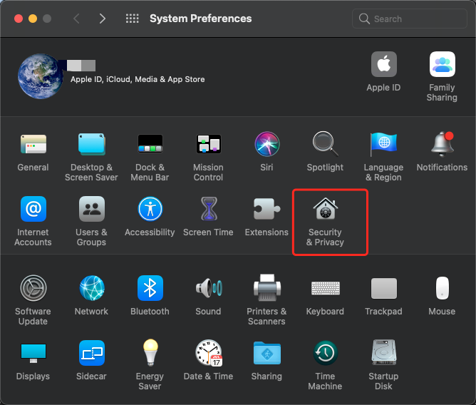
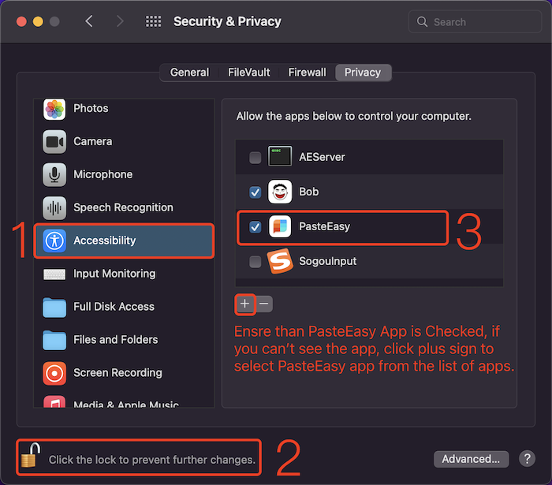
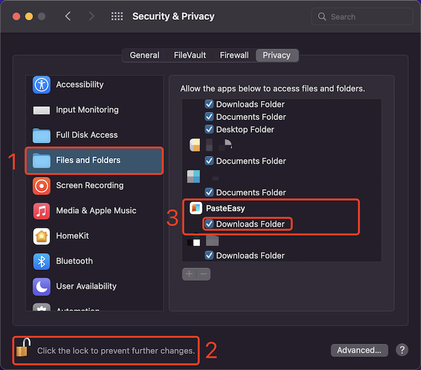

# PasteEasy
# 

[English] - [中文版](https://github.com/MinMao-Hub/PasteEasy/tree/main/cn)

### O、Feedback

### 👀 [Issues History](https://github.com/MinMao-Hub/PasteEasy/issues?q=)
### 🖌 [Report Issues & Feedback](https://github.com/MinMao-Hub/PasteEasy/issues/new) (Please [check](https://github.com/MinMao-Hub/PasteEasy/issues?q=) the issues history before reporting)
### 🛠 Hint： Use this repair software to fix it when you encounter PasteEasy crash that cannot be opened.[PasteEasyRepair](https://github.com/MinMao-Hub/PasteEasyRepair/releases/tag/1.0)

### I、Novice Guide

#### [Auto start tutorial:](https://github.com/MinMao-Hub/PasteEasy/blob/main/en/help_launch.md)

[Click to view the Boot Auto start tutorial](https://github.com/MinMao-Hub/PasteEasy/blob/main/en/help_launch.md)

#### About Show & Close:
 
The default shortcuts is `⌘⇧V`, reclick `⌘⇧V` or click ESC to close PasteBoard.
Besides, you can modify the shortcuts by preference

#### About Preferences
1. Statusbar -> Preference
2. More buttons in the upper right corner of the panel -> Preference
3. Click the shortcut key`⌘ ,` when the panel pops up. 

#### About Paste:
1. Double-click the small card for immediate paste.
2. Select the card and press the enter key to paste
3. Right-click done, PASTE pops up
4. Command + 1~9 Quickly paste the data currently in the display area
5. Press Key Command Or Shift and Select cards for multiple selection
6. Press Key Command Or Shift and switching the Left & Right on the keyboard for multiple selection

#### About Deletion
1. Right-click to selecct, and DELETE pops up
2. Select card and click key BACKSPACE  to delete historical records.
3. Preference: Delete all records.

#### About Search
1. You can click any number and letter key on the keyboard to start the search.
2. Accurate search for text and title
3. Accurate search according to type [text, picture, file, etc.] 
4. Accurate search according to the name of the pasted source app
5. For picture search, you can enter some keywords to search [pic, image , Pictures, etc.]
6. `⌘ F` to focus search

#### About Pin
1. Use the right-click menu to pin the frequently used content into a specific category. 
2. Customized Category is available ( Support for editing name, and deleting) 
3. The content added to the category will not be deleted even if it is deleted in the default panel and preference
4. The Pin bar scrolling is same as card list
5. You can use shortcut keys to quickly switch categories`⌘ [` 和 `⌘ ]`

***PS: The content under the category will be stored persistently, and it will not be deleted even if it is cleared in the preferences, it can be deleted individually***

#### About List Scrolling
1. Scroll the list by sliding the touchpad with two fingers 
2. Scroll the list by mouse wheel 
3. Scroll the list by incessantly pressing key Shift 
4. Scroll the list by switching the Left & Right on the keyboard[Switching]
5. Scroll the list by switching the Upper & Down on the keyboard[Turn the page]

##### About Right click menu
1. You can right-click to call up the menu to customize the title of the card
2. Paste as plain text
3. Only copy
2. You can extract MD5 strings of text, files, etc.
3. English case can be converted
4. The screenshot can be saved directly to the download folder
5. Recognize the QR code on the picture
6. Convert text to a QR code
7. Share Paste item to all applications of the system
8. Quick preview, you can use shortcut keys `Space`

#### About Display Position
* Set your favorite display position in preference

#### About BootStrap Auto Launch
* Set boot-up in preferences, then the application will be automatically launched when the system is turned on

#### Tips
* Resource will be reserved when the setting capacity is unlimited. To avoid occupying much hard disk capacity, Please clean up useless historical data regularly, or clear historical data according to time period in preferences.

### II、Start Auxiliary Program

***When the first time paste, the system will prompt you to set it.  If you refuse, just operate as follows.***

* Open system preferences, select Security and Privacy

* Click Accessibility, check Paste application

***PS: First, click the unlock function showed on the left lower corner of the below picture, then enter the password and complete setting, Next, re-lock is available.***

below

### III、FAQ
1. Why can't paste successfully?
  * Check whether the auxiliary program function is enabled [see the second item above]
2. The auxiliary program has been checked, but still cannot be pasted successfully
	* method 1 
		* exit the program
		* Re-check the [off and then on] auxiliary program function
		* Open the program
		* Copy a piece of text
	* Method 2
		* exit the program
		* Re-check the auxiliary program function
		* Restart the computer
	* Method 3
		* Remove PasteEasy from the list of helper programs and restart PasteEasy App
3. It keeps crashing and cannot be opened
  * This problem is generally caused by the unsupported content format in the current pasteboard or a software bug. Try to copy a paragraph of text again and open the application again. The problem can basically be solved.

4. Why does the screenshot fail to be saved?
	
	* The reason for this problem is that the request of read and write the download folder is rejected.
	* Open system preferences, select Security and Privacy
	* Select files and folders, and check the download folder under Paste, as shown below

### IV、Tips

1. Shortcuts for taking screenshots on Mac computers
  * Pressing `Shift+Control+Command+3` at the same time will take a screenshot of the entire screen in the clipboard;
  * Pressing the `Shift+Control+Command+4` keys at the same time enables you to take a screenshot of part of the screen by dragging the mouse and copy the picture to the clipboard

  So there is no need to open the desktop file and copy it to the clipboard~~

### VI、Contact and feedback

Mail: [m12860gyh@gmail.com](mailto:?to=m12860gyh@gmail.com&subject=关于Paste&body=Hi，MinMao)

WeChat / WhatsApp: `+86 15121178175`

Telegram Group:  [https://t.me/pasteeasy6](https://t.me/pasteeasy6)

