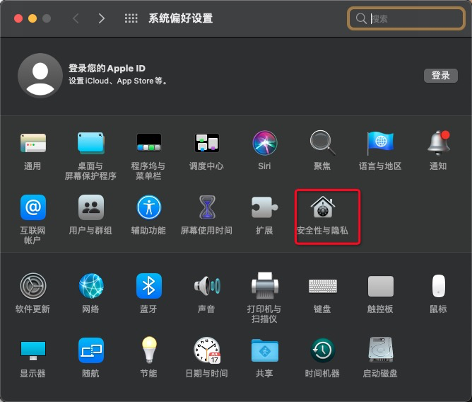
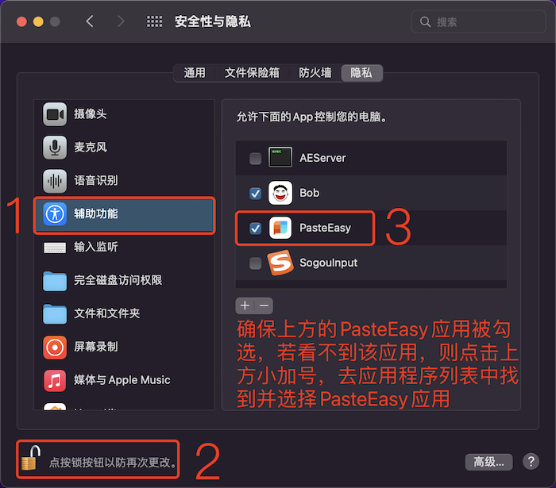
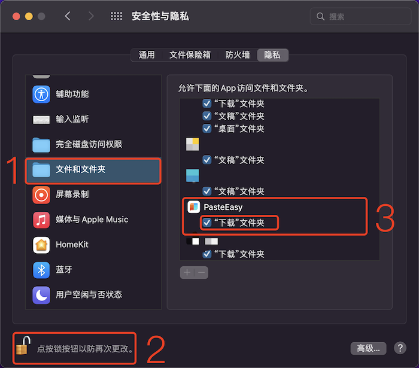

# PasteEasy
# 

[中文版] - [English](https://github.com/MinMao-Hub/PasteEasy)

### O、Feedback

### 👀 [问题历史](https://github.com/MinMao-Hub/PasteEasy/issues?q=)
### 🖌 [报告意见与反馈](https://github.com/MinMao-Hub/PasteEasy/issues/new)（报告之前请先查看[问题历史](https://github.com/MinMao-Hub/PasteEasy/issues?q=)，是否已存在你所遇到的问题）
### 🛠 重要提示： 遇到PasteEasy闪退不能打开的时候用这个修复软件修复一下即可。[PasteEasyRepair](https://github.com/MinMao-Hub/PasteEasyRepair/releases/tag/1.0)

### 0.1 交流群

纸飞机Telegram:  [https://t.me/pasteeasy6](https://t.me/pasteeasy6)

微信群贴这里，感兴趣的小伙伴可扫码入群：【有时候可能会忘记更新，加不到直接私聊我微信】

### 一、新手教程

#### [开机自动启动教程：](https://github.com/MinMao-Hub/PasteEasy/blob/main/cn/help_launch.md)

[点击查看开机自动启动教程](https://github.com/MinMao-Hub/PasteEasy/blob/main/cn/help_launch.md)

#### 关于唤醒和关闭：

默认唤醒快捷键为  `⌘⇧V`， 再次点击`⌘⇧V`关闭PasteBoard，或者点击键盘ESC关闭。

#### 偏好设置打开方式
1. 菜单栏 -> 偏好设置
2. 面板右上角更多按钮 -> 偏好设置
3. 面版弹出时点击快捷键 `⌘ ,`

#### 关于粘贴：
1. 双击小卡片立即粘贴；
2. 单击选中、键盘左右（位置在侧边时上、下键）键切换选中，点击Enter键一键粘贴；
3. 鼠标右键弹出菜单粘贴；
4. Command + 1~9 快速粘贴当前显示区域中的数据
5. 按键Command或Shift键并单击选择卡片以进行多选
6. 按住Command或Shift键并切换键盘上的左右键可进行多选

#### 关于删除：
1. 鼠标右键选中，弹窗删除；
2. 选中小卡片的情况下，点击backspace一键删除；
3. 偏好设置，一键清除所有记录；

#### 关于搜索：
1. 您可以点击键盘上的任何数字和字母键来开始搜索；
2. 文本和标题精准搜索；
3. 可根据类型精准搜索【文本、图片、文件等等】；
4. 可根据粘贴来源程序名称精准搜索； 
5. 图片搜索可输入一些关键字搜索【pic、image、图片等】；

#### 关于顶部分类
1. 点击小加号添加新分类，鼠标右键选中分类可以重命名、删除分类；
2. 可以将常用的内容钉起来，保存到自己喜欢的分类中；
3. 添加到分类中的内容在默认面板和偏好设置中删除也不会被删除；
4. 滚动同列表滚动；
5. 可以使用快捷键快捷切换分类 `⌘ [` 和 `⌘ ]`；

***PS： 分类下的内容会持久保存，在偏好设置中清除也不会被删除，可单独对其进行删除***

#### 关于滚动：
1. 笔记本可直接双指划动触控板滚动；
2. 鼠标滚轮滚动；
	* 正常滚动
	* 按住Shift快速滚动
3. 通过切换键盘上的左右键来翻阅列表[单个切换]
4. 通过切换键盘上的上和下键来滚动列表[翻页]

##### 右键菜单小功能
1. 可直接粘贴；
2. 粘贴为纯文本
3. 可直接复制
2. 可直接删除；
3. 可以给卡片自定义标题；
4. 可提取文本、文件等的MD5字符串；
5. 可对英文进行大小写转化；
6. 截图可直接保存到下载文件夹；
7. 识别图片上面的二维码；
8. 将文字转换为二维码；
9. 分享到系统各大应用中；
10. 快捷预览，可以使用快捷键 `空格键`

#### 关于展示位置
* 在偏好设置里面设置自己喜好的展示位置

#### 关于开机自启动
* 在偏好设置里面设置开机启动，则系统开机时会自动启动该应用

#### 温馨提示
* 当设置容量为无限时，资源会一直保留，为了避免占用过多硬盘资源，请定期删除无用历史数据，或者在偏好设置里面清除历史

### 二、启用辅助程序

***第一次粘贴的时候系统也会弹窗提示去设置，若拒绝了，则按照下方步骤添加一下即可：***

* 打开系统偏好设置，选择安全性与隐私

* 点击辅助功能，勾选Paste应用

***PS: 首先需要点击下图左下角解锁功能，输入密码，设置完成之后，重新锁定即可***

### 三、常见问题

1. 为什么无法粘贴成功？
	* 查看是否开启辅助程序功能【见上面第二大条】
2. 已勾选了辅助程序，仍然不能粘贴成功
	* 方法1
		* 从辅助程序列表中删除PasteEasy，然后重启PasteEasy
	* 方法2 
		* 退出程序
		* 重新勾选【关了再开】辅助程序功能
		* 打开程序
		* 复制一段文本
	* 方法3 
		* 退出程序
		* 重新勾选辅助程序功能
		* 重启电脑
3. 一直闪退无法打开
	* 下载修复软件[PasteEasyRepair](https://github.com/MinMao-Hub/PasteEasyRepair/releases/tag/1.0)， 点击修复一次即可。
5. 截图为什么保存失败？
	
	* 出现该问题的原因是，应用请求读写下载文件夹时被拒绝了
	* 打开系统偏好设置，选择安全性与隐私
	* 选择文件与文件夹，勾选Paste下面的下载文件夹，如下图所示

### 四、小提示

1. Mac截屏快捷键
	* 同时按下`Shift+Control+Command+3`键会在剪贴板里获取整个屏幕的截图；
	* 同时按下`Shift+Control+Command+4`键则能使你通过拖动鼠标来截取部分屏幕，并复制图片到剪贴板

	这样就不用打开桌面文件再复制到剪贴板啦～～

### 五、联系以及意见反馈

邮箱: [m12860gyh@163.com](mailto:?to=m12860gyh@163.com&subject=关于Paste&body=Hi，MinMao)

微信: `mp12860`
